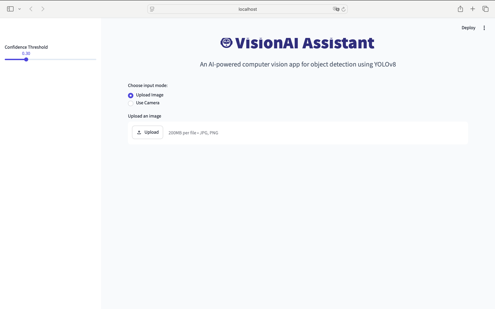
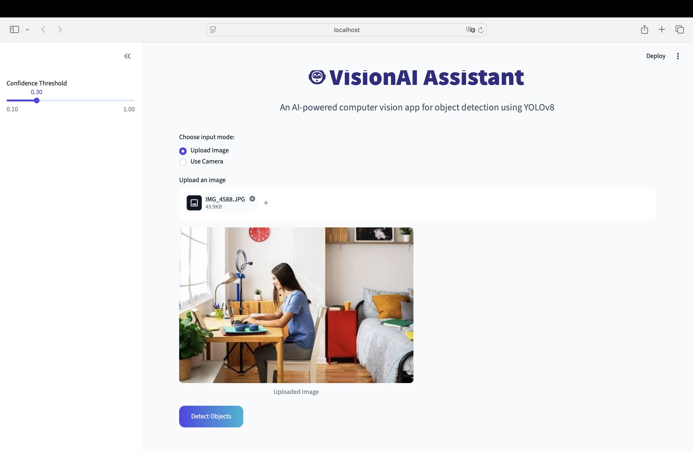
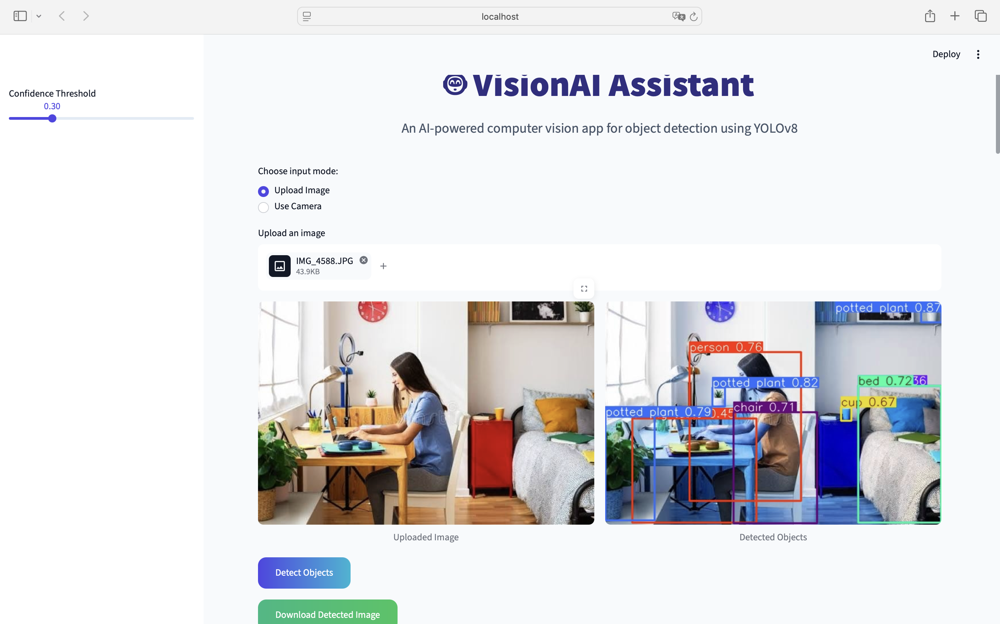
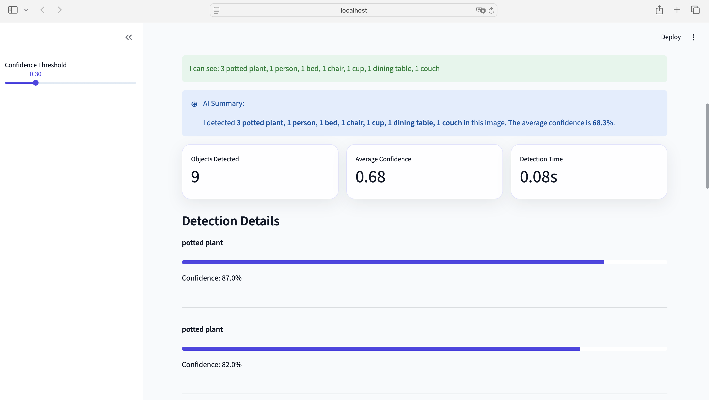
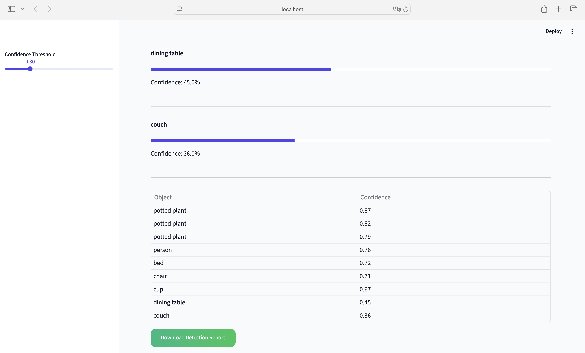
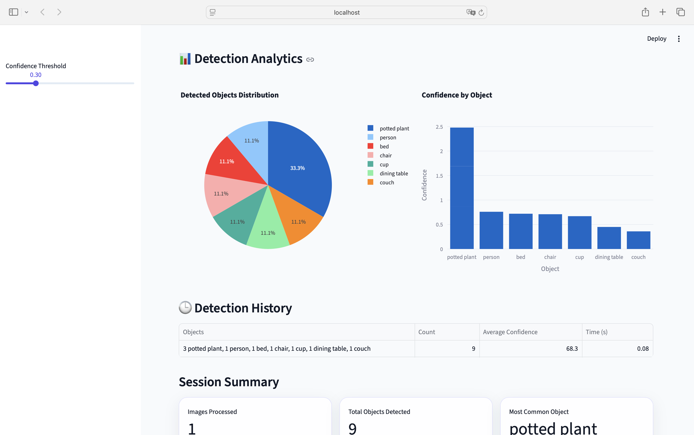

# 🤖 VisionAI Assistant

VisionAI Assistant is an interactive computer-vision application that detects objects in uploaded images and camera captures using YOLOv8.

The application presents annotated detection results, confidence scores, processing metrics, interactive analytics, session history, and downloadable reports through a Streamlit interface.

---

## ✨ Features

### Image Input

- Upload JPG, JPEG, or PNG images
- Capture an image directly using the device camera
- Switch easily between upload and camera modes

### YOLOv8 Object Detection

- Detect multiple objects in a single image
- Display bounding boxes and class labels
- Adjust the minimum confidence threshold
- Use the lightweight YOLOv8 Nano model

### Detection Summary

- Display a readable summary of detected objects
- Show the number of occurrences of each object
- Calculate the average confidence score

### Detection Metrics

- Total number of detected objects
- Average detection confidence
- Detection processing time

### Detailed Confidence Analysis

- Individual confidence score for every detection
- Visual confidence progress bars
- Tabular detection results

### Interactive Analytics

- Pie chart showing the distribution of detected object classes
- Bar chart comparing confidence scores by object
- Detection history during the current session

### Session Summary

- Number of images processed
- Total objects detected
- Most frequently detected object

### Downloadable Results

- Download the annotated image as a PNG
- Download detection results as a CSV report

---

## 📸 Application Preview

### Home Page



### Image Upload



### Detected Image



### Detection Result



### Detection Table



### Detection Analytics



---

## 🧠 How It Works

1. The user uploads an image or captures one using the camera.
2. The selected image is temporarily stored for model inference.
3. YOLOv8 processes the image using the chosen confidence threshold.
4. The application extracts:
   - object class names,
   - confidence scores,
   - bounding boxes.
5. YOLOv8 generates an annotated image showing detected objects.
6. VisionAI calculates summary statistics and detection time.
7. Plotly visualizations present the object distribution and confidence scores.
8. Detection results are added to the current Streamlit session history.
9. The annotated image and CSV detection report can be downloaded.

---

## 🛠️ Tech Stack

- **Python** — Application logic
- **Streamlit** — Web application interface
- **YOLOv8 / Ultralytics** — Object detection
- **Pillow** — Image loading and conversion
- **Pandas** — Detection report creation and data handling
- **Plotly** — Interactive charts and analytics

---

## 📁 Project Structure

```text
VisionAI-Assistant/
│
├── app.py
├── README.md
├── requirements.txt
├── .gitignore
├── yolov8n.pt
│
├── screenshots/
│   ├── home.png
│   ├── upload.png
│   ├── detection-result-1.png
│   └── detection-result-2.png
│
└── .streamlit/
    └── config.toml
```

The local `.venv` directory is excluded from GitHub through `.gitignore`.

---

## ⚙️ Installation

### 1. Clone the repository

```bash
git clone <repository-url>
cd VisionAI-Assistant
```

### 2. Create a virtual environment

```bash
python3 -m venv .venv
```

### 3. Activate the environment

#### macOS or Linux

```bash
source .venv/bin/activate
```

#### Windows

```bash
.venv\Scripts\activate
```

### 4. Install the dependencies

```bash
pip install -r requirements.txt
```

### 5. Run the application

```bash
streamlit run app.py
```

The application will open in your browser.

---

## 📊 CSV Report Format

The downloadable report includes:

- detection timestamp,
- detected object,
- confidence score,
- total processing time.

Example:

```text
timestamp,object,confidence,detection_time_seconds
2026-08-08 18:30:00,person,0.91,1.24
2026-08-08 18:30:00,car,0.87,1.24
```

---

## 🎯 Project Purpose

VisionAI Assistant was developed as an end-to-end computer-vision portfolio project.

It demonstrates how a pretrained machine-learning model can be integrated into an interactive application that combines:

- model inference,
- image processing,
- data analysis,
- interactive visualization,
- session-state management,
- downloadable outputs,
- and user-interface development.

---

## 🔮 Future Improvements

Possible future extensions include:

- Continuous webcam and video detection
- Custom-trained YOLO models
- Persistent detection history using a database
- Batch image processing
- Additional scene-level analysis
- User authentication
- Cloud deployment and model-performance optimization

---

## 👨‍💻 Author

**Hemant Singh Rathore**

B.Sc. Artificial Intelligence  
Friedrich-Alexander-Universität Erlangen-Nürnberg

---

## 📄 License

This project was created for educational and portfolio purposes.
